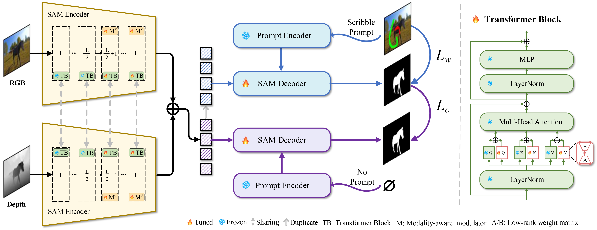

# SSFam: Scribble Supervised Salient Object Detection Family

The paper has been publishd by IEEE Transactions on Multimedia

[paper](https://arxiv.org/pdf/2409.04817)

DOI:



## All Codes
链接：https://pan.baidu.com/s/15BqvuAe6E3zcouuwAyet-w 
提取码：a6iw 

 

## Dataset
链接：https://pan.baidu.com/s/1VBxPC0Xm3dQdGTn_Q8ycaA 
提取码：y1tc 


## Model Parameters
链接：https://pan.baidu.com/s/13MQue5cU2Vsr2q7WkePR2w 
提取码：biqy 


## Pretraining Parameter
链接：https://pan.baidu.com/s/1sNNqLGKOWKup89-YCvy_pw 
提取码：7s8p 


##  Result Saliency Maps 
链接：https://pan.baidu.com/s/1EfuVQbLDwfpqjZF1k56z_w 
提取码：t4ot 


## Evaluation Code
链接：https://pan.baidu.com/s/1mCErgzU3Zxwqah5518IuaA 
提取码：3uoo 


### Citation

If you find the information useful, please consider citing:

```
@article{liu2025ssfam,
  title={SSFam: Scribble Supervised Salient Object Detection Family},
  author={Liu, Zhengyi and Deng, Sheng and Wang, Xinrui and Wang, Linbo and Fang, Xianyong and Tang, Bin},
  journal={IEEE Transactions on Multimedia},
  year={2025},
  pages={1988--2000},
  publisher={IEEE}
}
```
If you have any question, please email  liuzywen@ahu.edu.cn
